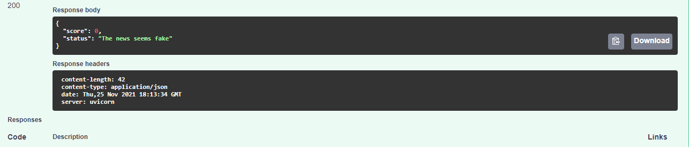

### An NLP fake_news detection API built with Python

* This AI-powered API predicts whether a news article is authentic or fake based on its title, content(text) and subject(news category).

* DATA_SOURCE:[University of Victoria ISOT Research Lab](https://www.uvic.ca/engineering/ece/isot/datasets/fake-news/index.php).

* The Dataset consists of a seperate True.csv(for the part of the data that reads true that a particular news is fake) and False.csv(For the part of the data that reads false that a particular news is fake).

* The datasets are then concatenated and shuffled together into a single dataset and uploaded to [AWS S3](https://docs.aws.amazon.com/AmazonS3/latest/userguide/Welcome.html) and remotely read as a csv file from the S3 Bucket.

* The model has been trained on a seperate jupyter notebook which you can find [here](https://github.com/E-wave112/ml_proj1/blob/master/aws_nlp.ipynb) and loaded to the model file via [Keras](https://keras.io/api/models/model/).

 ### Running the Project

To get started with this project clone the repo by running the command git clone https://github.com/E-wave112/fake_space.git or downloading the zip file.
 * create and activate your virtual environment more guides on how to do that [here](https://realpython.com/python-virtual-environments-a-primer/).

* In the root of the project install the required dependencies

```
$ pip install -r requirements.txt
```

* run the server via the command

```
$ uvicorn application:app --reload
```

* The server will be running on http://localhost:8000

### Demo Example

* The snapshots below shows an instance where the api gets a requested with the right inputs and then the machine learning system then infers the authenticity of the news. it all happens in a two way process!

- Step 1 : user inputs the relevant data


- Step 2 : the systems predicts the authenticity of the news (score of 1 indicates an authentic news while a score of 0 indicates otherwise)




## Containerizing the application


### Build the initial docker image
```
$ docker-compose up --build
```
### Running the Dev Docker container

To run the application, use the following command:

```
$ docker-compose up
```
* The app will be running on http://127.0.0.1:8000
* Access the docker image for this project [here](https://hub.docker.com/repository/docker/ewave112/fake_space_image)
* It is not recommended to use alpine based images for this project(or most of any other python projects) and here's [why](https://github.com/tiangolo/uvicorn-gunicorn-fastapi-docker#-alpine-python-warning)

* A useful resource on how to push your docker image to [DockerHub](https://hub.docker.com)  can be found [here](https://ropenscilabs.github.io/r-docker-tutorial/04-Dockerhub.html)


**Wanna check out my other machine learning projects and implementations?**  check them out [here](https://github.com/E-wave112/ml_proj1).
